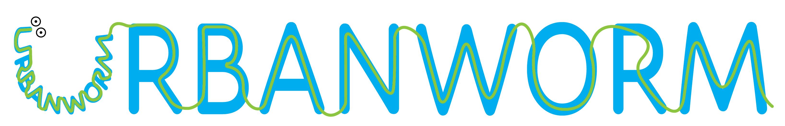
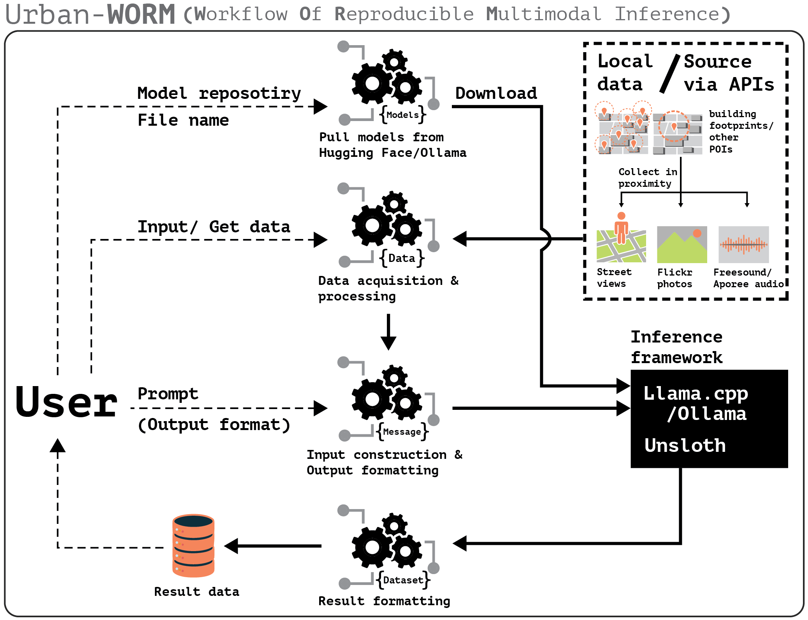

[](https://pypi.python.org/pypi/urban-worm)
[](https://pepy.tech/project/urban-worm)
[](https://pepy.tech/projects/urban-worm)
[](https://billbillbilly.github.io/urbanworm/)
[](https://colab.research.google.com/github/billbillbilly/urbanworm/blob/main/docs/example_colab.ipynb)

<picture>
  
</picture>

# Urban-WORM

## Introduction
Urban-**WORM** (**W**orkflow **O**f **R**eproducible **M**ultimodal Inference) is a user-friendly high-level interface
designed for building geo-referenced urban datasets with model-generated ground-truth labels.
It covers the full pipeline — from collecting crowdsourced street views, photos, and sounds
near building footprints, through batched VLM inference, to an organized export of labeled metadata.

- Free software: MIT license
- Website/Documentation: [https://billbillbilly.github.io/urbanworm/](https://billbillbilly.github.io/urbanworm/)

<picture>
  
</picture>

## Features

**Data collection**
- Collect geotagged street views (Mapillary/Google), photos (Flickr), and audio (Freesound/Radio Aporee) within the proximity of building footprints or other POIs
- Calibrate panorama orientation to face a given location; auto-compute field-of-view from building footprints
- Filter personal photos with face detection; slice audio recordings into fixed-duration clips
- **Crash-safe checkpointing** — pass `checkpoint_path` to any collection method; already-fetched locations are skipped on resume, so a failed run never starts from zero

**Inference / ground-truth labeling**
- Define a structured output schema once; all backends share the same `one_inference` / `batch_inference` interface
- **Unsloth** (recommended) — GPU-accelerated local VLM with optional GPU batching; 2–4× faster than Ollama; automatically spreads the model across all visible GPUs when more than one is present, with OOM-safe chunk retry so failed batches fall back to item-by-item instead of producing silent stub outputs
- **Ollama** — lightweight local inference, no GPU required
- **llama.cpp** — highly customizable sampling; supports audio input
- **Cloud APIs** — Claude (Anthropic), GPT-4o (OpenAI), Gemini (Google) via `InferenceAPI`
- **Crash-safe checkpointing** on all `batch_inference` methods — resume mid-run without reprocessing completed images

Note: models can make mistakes and results still need to be reviewed and used carefully.

**Export**
- `GeoTaggedData.export()` — one call produces a `metadata.csv` paired with an organized `images/` or `audio/` folder, with optional label columns merged in

## Installation

### Step 1 — Core package

```sh
pip install urban-worm
```

### Step 2 — Choose your inference backend

Unsloth is the **recommended** backend for local inference (GPU-accelerated, fastest).

#### Unsloth — recommended (GPU required)

GPU-specific torch must be installed **before** the `unsloth` extra, otherwise pip falls back to
a slow CPU-only build:

```sh
# CUDA 12.4 (most modern NVIDIA GPUs):
pip install torch --index-url https://download.pytorch.org/whl/cu124

# CUDA 12.1:
pip install torch --index-url https://download.pytorch.org/whl/cu121

# macOS Apple Silicon (MPS):
pip install torch          # MPS is enabled by default on macOS
```

Then install the extra:

```sh
pip install "urban-worm[unsloth]"
```

Tested checkpoints: `unsloth/Qwen3-VL-3B-Instruct`, `unsloth/Qwen3-VL-8B-Instruct`,
`unsloth/gemma-3-4b-it`, `unsloth/Qwen2-VL-2B-Instruct`, `unsloth/Qwen2.5-VL-7B-Instruct-bnb-4bit`.
Any vision model that `unsloth.FastVisionModel` can load should work.

#### Ollama — lightweight local inference (no GPU required)

Install the [Ollama application](https://ollama.com/) first:

```sh
# Linux
curl -fsSL https://ollama.com/install.sh | sh

# macOS
brew install ollama

# Windows — download the installer from https://ollama.com/
```

Then install the Python client:

```sh
pip install "urban-worm[ollama]"
```

#### llama.cpp — CLI-based local inference

The `llama-mtmd-cli` binary must be installed separately:

```sh
# macOS / Linux
brew install llama.cpp

# Windows
winget install llama.cpp
```

More options: [llama.cpp install guide](https://github.com/ggml-org/llama.cpp/blob/master/docs/install.md).
GGUF model collections: [ggml-org multimodal GGUFs](https://huggingface.co/collections/ggml-org/multimodal-ggufs-68244e01ff1f39e5bebeeedc).

The Python binding is installed via the extra:

```sh
# CPU build (no compile flags needed):
pip install "urban-worm[llamacpp]"

# CUDA build:
CMAKE_ARGS="-DGGML_CUDA=on" pip install "urban-worm[llamacpp]"

# Metal build (macOS):
CMAKE_ARGS="-DGGML_METAL=on" pip install "urban-worm[llamacpp]"
```

#### Cloud APIs (Claude / GPT-4o / Gemini)

```sh
pip install "urban-worm[api]"
```

#### Audio support (optional)

Only needed if you use `get_sound_from_location()`:

```sh
pip install "urban-worm[audio]"
```

### All extras at once

> **Note:** GPU torch must still be pre-installed before running `pip install "urban-worm[all]"`.
> See the Unsloth section above.

```sh
pip install "urban-worm[all]"          # all backends + API providers (no audio)
pip install "urban-worm[all,audio]"    # + audio slicing
```

### Dev install from source

```sh
pip install -e git+https://github.com/billbillbilly/urbanworm.git#egg=urban-worm
pip install "urban-worm[dev]"
```

## Usage

### Collect street views with crash-safe checkpointing

```python
from urbanworm import GeoTaggedData

gtd = GeoTaggedData()
gtd.getBuildings(bbox=(-83.208, 42.374, -83.206, 42.375), source='osm')

# Step 1 — fetch metadata from Mapillary (resumes from svi.jsonl if interrupted)
gtd.get_svi_from_locations(
    key="YOUR_MAPILLARY_KEY",
    distance=30,
    reoriented=True,
    checkpoint_path="run/svi.jsonl",
)

# Step 2 — download images to disk (resume-safe: existing files are never overwritten)
gtd.download_to_dir(data='svi', to_dir='run/images')
```

### Inference with a local VLM (Unsloth — recommended)

```python
from urbanworm import InferenceUnsloth
from typing import Literal

schema = {
    "occupancy": (Literal["occupied", "unoccupied", "uncertain"], ...),
    "visual_evidence": (str, ...),
}

infer = InferenceUnsloth(
    llm="unsloth/Qwen3-VL-3B-Instruct",
    load_in_4bit=True,
    geo_tagged_data=gtd,
    schema=schema,
    # device and max_memory are optional — defaults shown below:
    # device=None        → auto: "auto" when multiple GPUs are detected,
    #                      "cuda:0" for a single GPU, "cpu" otherwise
    # max_memory=None    → auto: 90 % of each GPU's total VRAM, e.g.
    #                      {0: "10GiB", 1: "10GiB"} for two 12 GB GPUs
)

df = infer.batch_inference(
    system="You are an urban researcher assessing housing conditions.",
    prompt="Is this house occupied or vacant? Describe the visual evidence.",
    batch_size=4,             # batch > 1 trades VRAM for throughput
    max_new_tokens=256,
    checkpoint_path="run/labels.jsonl",   # resume-safe
)
```

> **Multi-GPU note** — when multiple CUDA GPUs are present, `InferenceUnsloth`
> automatically sets `device_map="auto"` and splits the model layers across all
> of them.  You can override the per-GPU memory budget with `max_memory`, for
> example `max_memory={0: "10GiB", 1: "10GiB"}` to leave 2 GB headroom on each
> of two 12 GB cards.  If a batch triggers an out-of-memory error at runtime,
> the failed chunk is automatically retried one item at a time after clearing
> the CUDA cache, so you lose at most one image rather than the entire batch.

### Inference with a cloud API

```python
from urbanworm import InferenceAPI

infer = InferenceAPI(
    llm="claude-sonnet-4-5",   # or "gpt-4o", "gemini-2.0-flash"
    provider="anthropic",       # or "openai", "google"
    api_key="YOUR_API_KEY",
    geo_tagged_data=gtd,
    schema=schema,
)

df = infer.batch_inference(
    system="You are an urban researcher assessing housing conditions.",
    prompt="Is this house occupied or vacant? Describe the visual evidence.",
    checkpoint_path="run/labels_claude.jsonl",
)
```

### Export to an organized dataset

```python
# Produces dataset/metadata.csv + dataset/images/
csv_path = gtd.export(output_dir="dataset", data="svi", labels=df)
```

More examples: [`docs/1_basic_inference.ipynb`](docs/1_basic_inference.ipynb),
[`docs/3_ground_truth_labeling.ipynb`](docs/3_ground_truth_labeling.ipynb).

## To do

v0.1.x:
- [x] A module for collecting social media data (Flickr and Freesound)
- [x] A method for inferencing sound recordings

v0.2.x:
- [x] Crash-safe checkpointing for collection and inference
- [x] Cloud API inference backend (Claude / GPT-4o / Gemini)
- [x] `export()` — organized dataset export with metadata CSV
- [x] Full ground-truth labeling tutorial notebook
- [ ] A web UI providing interactive operation and data visualization

## Legal Notice
This repository and its content are provided for educational and research purposes only. By using the information and
code provided, users acknowledge that they are using the APIs and models at their own risk and agree to comply with any
applicable laws and regulations.

## Acknowledgements
The inference backends are built on:
- [unsloth](https://github.com/unslothai/unsloth)
- [llama.cpp](https://github.com/ggml-org/llama.cpp/tree/master)
- [ollama](https://github.com/ollama/ollama) / [ollama-python](https://github.com/ollama/ollama-python)
- [Anthropic SDK](https://github.com/anthropics/anthropic-sdk-python)
- [OpenAI SDK](https://github.com/openai/openai-python)
- [Google GenAI SDK](https://github.com/googleapis/python-genai)

The GIS data sourcing, image processing, and data collection functionality is built on:
- [GlobalMLBuildingFootprints](https://github.com/microsoft/GlobalMLBuildingFootprints)
- [Equirec2Perspec](https://github.com/fuenwang/Equirec2Perspec)
- [Mapillary API](https://www.mapillary.com/developer/api-documentation)
- [Flickr API](https://www.flickr.com/services/api/)
- [Freesound API](https://freesound.org/apiv2/apply)

The development of this package is supported and inspired by the city of Detroit.
